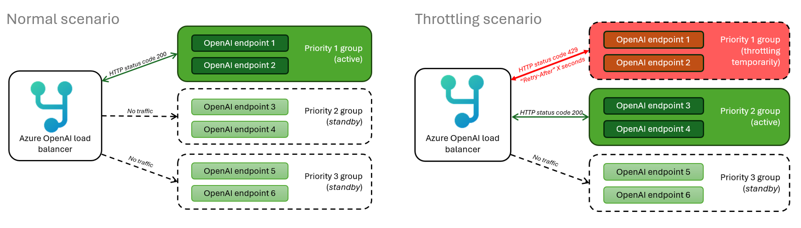

# :rocket: Smart load balancing for OpenAI endpoints

Many service providers, including OpenAI, usually set limits on the number of calls that can be made. In the case of Azure OpenAI, there are token limits (TPM or tokens per minute) and limits on the number of requests per minute (RPM). When a server starts running out of resources or the service limits are exhausted, the provider may issue a 429 or TooManyRequests HTTP Status code, and also a Retry-After response header indicating how much time you should wait until you try the next request.

The solution presented here is part of comprehensive one that takes into consideration things like a good UX/workflow design, adding application resiliency and fault-handling logic, considering service limits, choosing the right model for the job, the API policies, setting up logging and monitoring among other considerations. This solution seamlessly expose a single endpoint to your applications while keeping an efficient logic to consume two or more OpenAI or any API backends based on availability and priority.

It is built using the high-performance [YARP C# reverse-proxy](https://github.com/microsoft/reverse-proxy) framework from Microsoft. However, you don't need to understand C# to use it, you can just build the provided Docker image.
This is an alternative solution to the [API Management OpenAI smart load balancer](https://github.com/andredewes/apim-aoai-smart-loadbalancing), with the same logic.

## :sparkles: Why do you call this "smart" and different from round-robin load balancers?

One of the key components of handling OpenAI throttling is to be aware of the HTTP status code error 429 (Too Many Requests). There are [Tokens-Per-Minute and a Requests-Per-Minute](https://learn.microsoft.com/en-us/azure/ai-services/openai/how-to/quota?tabs=rest#understanding-rate-limits) rate limiting in Azure OpenAI. Both situations will return the same error code 429.

Together with that HTTP status code 429, Azure OpenAI will also return a HTTP response header called "Retry-After", which is the number of seconds that instance will be unavailable before it starts accepting requests again.

These errors are normally handled in the client-side by SDKs. This works great if you have a single API endpoint. However, for multiple OpenAI endpoints (used for fallback) you would need to manage the list of URLs in the client-side too, which is not ideal.

What makes this solution different than others is that it is aware of the "Retry-After" and 429 errors and intelligently sends traffic to other OpenAI backends that are not currently throttling. You can even have a priority order in your backends, so the highest priority are the ones being consumed first while they are not throttling. When throttling kicks in, it will fallback to lower priority backends while your highest ones are waiting to recover.

Another important feature: there is no time interval between attempts to call different backends. Many of other OpenAI load balancers out there configure a waiting internal (often exponential). While this is a good idea doing at the client side, making a server-side load balancer to wait is not a good practice because you hold your client and consume more server and network capacity during this waiting time. Retries on the server-side should be immediate and to a different endpoint.

Check this diagram for easier understanding:


## :1234: Priorities

One thing that stands out in the above images is the concept of "priority groups". Why do we have that? That's because you might want to consume all your available quota in specific instances before falling back to others. For example, in this scenario:
- You have a [PTU (Provisioned Throughput)](https://learn.microsoft.com/en-us/azure/ai-services/openai/concepts/provisioned-throughput) deployment. You want to consume all its capacity first because you are paying for this either you use it or not. You can set this instance(s) as **Priority 1**
- Then you have extra deployments using the default S0 tier (token-based consumption model) spread in different Azure regions which you would like to fallback in case your PTU instance is fully occupied and returning errors 429. Here you don't have a fixed pricing model like in PTU but you will consume these endpoints only during the period that PTU is not available. You can set these as **Priority 2**

Another scenario:
- You don't have any PTU (provisioned) deployment but you would like to have many S0 (token-based consumption model) spread in different Azure regions in case you hit throttling. Let's assume your applications are mostly in USA.
- You then deploy one instance of OpenAI in each region of USA that has OpenAI capacity. You can set these instance(s) as **Priority 1**
- However, if all USA instances are getting throttled, you have another set of endpoints in Canada, which is closest region outside of USA. You can set these instance(s) as **Priority 2**
- Even if Canada also gets throttling at the same at as your USA instances, you can fallback to European regions now. You can set these instance(s) as **Priority 3**
- In the last case if all other previous endpoints are still throttling during the same time, you might even consider having OpenAI endpoints in Asia as "last resort". Latency will be little bit higher but still acceptable. You can set these instance(s) as **Priority 4**

And what happens if I have multiple backends with the same priority? Let's assume I have 3 OpenAI backends in USA with all Priority = 1 and all of them are not throttling? In this case, the algorithm will randomly pick among these 3 URLs.

## :gear: Getting started

The source code provides a Dockerfile, which means you are free to build and deploy to your own service, as long as it supports container images.

### [Option 1] Deploy the service directly to an Azure Container Apps

If you are not comfortable working with container images and you would like a very easy way to test this load balancer in Azure, you can deploy quickly to [Azure Container Apps](https://azure.microsoft.com/products/container-apps):

[](https://portal.azure.com/#create/Microsoft.Template/uri/https%3A%2F%2Fraw.githubusercontent.com%2Fazure%2Faoai-smart-loadbalancing%2Fmain%2Fazuredeploy.json)

- Clicking the Deploy button above, you will be taken to an Azure page with the required parameters. You need to fill the parameters beginning with "Backend_X_" (see below in [Configuring the OpenAI endpoints](#Configuring-the-OpenAI-endpoints) for more information on what they do)
- After the deployment is finished, go to your newly created Container Apps service and from the Overview menu, get the Application Url of your app. The format will be "https://app-[something].[region].azurecontainerapps.io". This is the URL you will call from your client applications


### [Option 2] Build and deploy as a Docker image

If you want to clone this repository and build your own image instead of using the pre-built public image:

`
docker build -t aoai-smart-loadbalancing:v1 .
`

This will use the Dockerfile which will build the source code inside the container itself (no need to have .NET build tools in your host machine) and then it will copy the build output to a new runtime image for ASP.NET 8. Just make sure your Docker version supports [multi-stage](https://docs.docker.com/build/building/multi-stage/) builds. The final image will have around 87 MB.

### [Option 3] Deploy the pre-built image from Docker hub

If you don't want to build the container from the source code, you can pull it from the public Docker registry:

`
docker pull andredewes/aoai-smart-loadbalancing:v1
`

### Configuring the OpenAI endpoints

After you deployed your container service using one of the methods above, it is time to adjust your OpenAI backends configuration using environment variables.
This is the expected format you must provide:

| Environment variable name | Mandatory | Description                                                                                                                                                                                                                                                                                                                                                                                                                                                                                                                                                                                                                                                                                                                                                                                                           | Example                               |
|---------------------------|-----------|-----------------------------------------------------------------------------------------------------------------------------------------------------------------------------------------------------------------------------------------------------------------------------------------------------------------------------------------------------------------------------------------------------------------------------------------------------------------------------------------------------------------------------------------------------------------------------------------------------------------------------------------------------------------------------------------------------------------------------------------------------------------------------------------------------------------------|---------------------------------------|
| BACKEND_X_URL             | Yes       | The full Azure OpenAI URL. Replace "_X_" with the number of your backend. For example, "BACKEND_1_URL" or "BACKEND_2_URL"                                                                                                                                                                                                                                                                                                                                                                                                                                                                                                                                                                                                                                                                                             | https://andre-openai.openai.azure.com |
| BACKEND_X_PRIORITY        | Yes       | The priority of your OpenAI endpoint. Lower numbers means higher priority. Replace "_X_" with the number of your backend. For example, "BACKEND_1_PRIORITY" or "BACKEND_2_PRIORITY"                                                                                                                                                                                                                                                                                                                                                                                                                                                                                                                                                                                                                                   | 1                                     |
| BACKEND_X_APIKEY          | Yes       | The API key of your OpenAI endpoint. Replace "_X_" with the number of your backend. For example, "BACKEND_1_APIKEY" or "BACKEND_2_APIKEY"                                                                                                                                                                                                                                                                                                                                                                                                                                                                                                                                                                                                                                                                             | 761c427c520d40c991299c66d10c6e40      |
| BACKEND_X_DEPLOYMENT_NAME | No        | If this setting is set, the incoming client URL will have the deployment name overridden. For example, an incoming HTTP request is:<br><br>https://andre-openai-eastus.openai.azure.com/openai/deployments/gpt35turbo/chat/completions?api-version=2023-07-01-preview <br><br>The **gpt35turbo** will be replaced by this setting when the request goes to your backend. In this way, you don't need to have all the deployment names as the same across your endpoints. You can even mix different GPT models (like GPT35 and GPT4), even though this is not recommended. <br><br>If nothing is set, the incoming URL coming from your client applications will be kept the same when sending to the backend, it will not be overridden. That means your deployment names must be the same in your OpenAI endpoints. | your-openai-deployment-name           |

For example, let's say you would like to configure the load balancer to have a main endpoint (we call it here BACKEND_1). We set it with the highest priority 1. And then we have two more endpoints as fallback in case the main one is throttling... we define then BACKEND_2 and BACKEND_3 with the same priority of 2:


| Environment variable name | Value                                   |
|---------------------------|-----------------------------------------|
| BACKEND_1_URL             | https://andre-openai.openai.azure.com   |
| BACKEND_1_PRIORITY        | 1                                       |
| BACKEND_1_APIKEY          | 33b9996ce4644bc0893c7988bae349af        |
| BACKEND_2_URL             | https://andre-openai-2.openai.azure.com |
| BACKEND_2_PRIORITY        | 2                                       |
| BACKEND_2_APIKEY          | 412ceac74dde451e9ac12581ca50b5c5        |
| BACKEND_3_URL             | https://andre-openai-3.openai.azure.com |
| BACKEND_3_PRIORITY        | 2                                       |
| BACKEND_3_APIKEY          | 326ec768694d4d469eda2fe2c582ef8b        |

It is important to always create 3 environment variables for each new OpenAI endpoint that you would like to use.

### Load balancer settings

This is the list of environment variables that are used to configure the load balancer in global scope, not only for specific backend endpoints:

| Environment variable name | Mandatory | Description                                                                                                                                                                                                                                       | Example             |
|---------------------------|-----------|---------------------------------------------------------------------------------------------------------------------------------------------------------------------------------------------------------------------------------------------------|---------------------|
| HTTP_TIMEOUT_SECONDS      | No        | If set, it will change the default 100 seconds timeout when waiting for OpenAI responses to something else.<br>If a timeout is reached, the endpoint it will be marked unhealthy for 10 seconds and the request will fallback to another backend. | 120                 |
| HTTPS_PROXY               | No        | If set, it will use a proxy to make the requests to OpenAI endpoints.                                                                                                                                                                             | http://myproxy:8080 |

### Testing the solution

To test if everything works by running some code of your choice, e.g., this code with OpenAI Python SDK:
```python
from openai import AzureOpenAI

client = AzureOpenAI(
    azure_endpoint="https://<your_load_balancer_url>",  #if you deployed to Azure Container Apps, it will be 'https://app-[something].[region].azurecontainerapps.io'
    api_key="does-not-matter", #The api-key sent by the client SDKs will be overriden by the ones configured in the backend environment variables
    api_version="2023-12-01-preview"
)

response = client.chat.completions.create(
    model="<your_openai_deployment_name>",
    messages=[
        {"role": "system", "content": "You are a helpful assistant."},
        {"role": "user", "content": "What is the first letter of the alphabet?"}
    ]
)
print(response)
```

### Scalability vs Reliability
This solution addresses both scalability and reliability concerns by allowing your total Azure OpenAI quotas to increase and providing server-side failovers transparently for your applications. However, if you are looking purely for a way to increase default quotas, I still would recommend that you follow the official guidance to [request a quota increase](https://learn.microsoft.com/azure/ai-services/openai/quotas-limits#how-to-request-increases-to-the-default-quotas-and-limits).

### Multiple load balancer instances
This solution uses the local memory to store the endpoints health state. That means each instance will have its own view of the throttling state of each OpenAI endpoint. What might happen during runtime is this:
- Instance 1 receives a customer request and gets a 429 error from backend 1. It marks that backend as unavailable for X seconds and then reroute that customer request to next backend
- Instance 2 receives a customer request and sends that request again to backend 1 (since its local cached list of backends didn't have the information from instance 1 when it marked as throttled). Backend 1 will respond with error 429 again and instance 2 will also mark it as unavailable and reroutes the request to next backend

So, it might occur that internally, different instances will try route to throttled backends and will need to retry to another backend. Eventually, all instances will be in sync again at a small cost of unnecessary roundtrips to throttled endpoints.
I honestly think this is a very small price to pay, but if you want to solve that you can always change the source code to use an external shared cache such as Redis, so all instances will share the same cached object.

Having this in mind, be careful when you configure your hosting container service when it comes to scalability. For instance, the default scaling rules in a Azure Container Apps is the number of concurrent HTTP requests: if it is higher than 10, it will create another container instance. This effect is undesirable for the load balancer as it will create many instances, and that's why the Quick Deploy button in this repo changes that default behavior to only scale the container when CPU usage is higher than 50%.

### Logging
The default logging features coming from [YARP](https://microsoft.github.io/reverse-proxy/articles/diagnosing-yarp-issues.html) are not changed here, it is still applicable. For example, you should see these log lines being print in the container console (Stdout) when requests are sucesfully redirected to the backends:

```
info: Yarp.ReverseProxy.Forwarder.HttpForwarder[9]
info: Proxying to https://andre-openai-eastus.openai.azure.com/openai/deployments/gpt35turbo/chat/completions?api-version=2023-07-01-preview HTTP/2 RequestVersionOrLower 
info: Yarp.ReverseProxy.Forwarder.HttpForwarder[56]
info: Received HTTP/2.0 response 200.
info: Yarp.ReverseProxy.Forwarder.HttpForwarder[9]
info: Proxying to https://andre-openai-eastus.openai.azure.com/openai/deployments/gpt35turbo/chat/completions?api-version=2023-07-01-preview HTTP/2 RequestVersionOrLower 
info: Yarp.ReverseProxy.Forwarder.HttpForwarder[56]
info: Received HTTP/2.0 response 200.
```

Now, these are example of logs generated when the load balancer receives a 429 error from the OpenAI backend:

```
info: Yarp.ReverseProxy.Forwarder.HttpForwarder[56]
info: Received HTTP/2.0 response 429.
warn: Yarp.ReverseProxy.Health.DestinationHealthUpdater[19]
warn: Destination `BACKEND_4` marked as 'Unhealthy` by the passive health check is scheduled for a reactivation in `00:00:07`.
```
Notice that it reads the value coming in the "Retry-After" header from OpenAI response and marks that backend as Unhealthy and it also prints how much time it will take to be reactivated. In this case, 7 seconds.

And this is the log line that appears after that time is elapsed:

```
info: Yarp.ReverseProxy.Health.DestinationHealthUpdater[20]
info: Passive health state of the destination `BACKEND_4` is reset to 'Unknown`.
```

It is OK that it says the status is reset to "Unknown". That means that backend will be actively receiving HTTP requests and its internal state will be updated to Healthy if it receives a 200 response from the OpenAI backend next time. This is called Passive health check and is a [YARP feature](https://microsoft.github.io/reverse-proxy/articles/dests-health-checks.html#passive-health-checks).


## :question: FAQ

### What happens if all backends are throttling at the same time?
In that case, the load balancer will route a random backend in the list. Since that endpoint is throttling, it will return the same 429 error as the OpenAI backend. That's why it is **still important for your client application/SDKs to have a logic to handle retries**, even though it should be much less frequent.

### Reading the C# logic is hard for me. Can you describe it in plain english?
Sure. That's how it works when the load balancer gets a new incoming request:

1. From the list of backends defined in the environment variables, it will pick one backend using this logic:
    1. Selects the highest priority (lower number) that is not currently throttling. If it finds more than one healthy backend with the same priority, it will randomly select one of them
2. Sends the request to the chosen backend URL
    1. If the backend responds with success (HTTP status code 200), the response is passed to the client and the flow ends here
    2. If the backend responds with error 429 or 5xx
        1. It will read the HTTP response header "Retry-After" to see when it will become available again
        2. Then, it marks that specific backend URL as throttling and also saves what time it will be healthy again
        3. If there are still other available backends in the pool, it runs again the logic to select another backend (go to the point 1. again and so on)
        4. If there are no backends available (all are throttling), it will send the customer request to the first backend defined in the list and return its response

## :link: Related articles
- The same load balancer logic but using Azure API Management: [Smart Load-Balancing for Azure OpenAI with Azure API Management](https://github.com/andredewes/apim-aoai-smart-loadbalancing)
